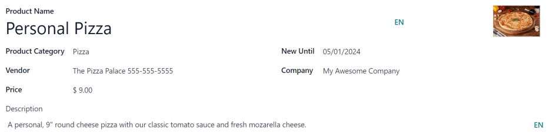
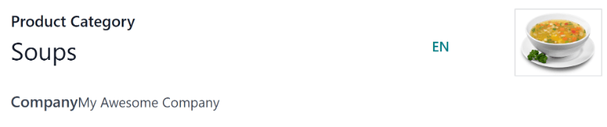

========
Products
========

No products are pre-configured in Odoo's *Lunch* app. Before any orders can be placed, the
individual products that are being offered must first be configured.

First, navigate to the products page by going to :menuselection:`Lunch app --> Configuration:
Products`. Next click the :guilabel:`New` button in the top-left corner and a blank product form
loads.

Enter the following information on the form:

- :guilabel:`Product Name*`: enter the name for the product.
- :guilabel:`Product Category*`: using the drop-down menu, select the :ref:`category
  <lunch/product-categories>` this product falls under.
- :guilabel:`Vendor*`: using the drop-down menu, select the vendor that supplies this product.
- :guilabel:`Price`: enter the price for the product. The currency is determined by the localization
  of the company.
- :guilabel:`Description`: enter a description of the product in this field. This description
  appears beneath the product photo when users are viewing the options for the day.
- :guilabel:`New Until`: using the calendar popover, select the date that the product will no
  longer be labeled as new. Until this date, a green `New` tag appears on the product.
- :guilabel:`Company`: if the product should only be available to a specific company, select it from
  the drop-down menu. If this field is left blank, this product is available for all companies in
  the database.
- Image: hover over the image box in the top-right corner of the form, and click the
  :icon:`fa-pencil` :guilabel:`(pencil)` icon that appears. A file explorer pop-up window appears.
  Navigate to the image, then click :guilabel:`Open`.

  (*) indicates required field.

.. _lunch/product-categories:

Product categories
==================

Product categories are a way to organize the offerings in the *Lunch* app, and allows for users to
quickly filter the offerings when reviewing the menu for the day.

To add or modify categories, navigate to :menuselection:`Lunch app --> Configuration: Product
Categories`. The available categories appear in a list view. In the *Lunch* app, there are four
default categories : :guilabel:`Sandwich`, :guilabel:`Pizza`, :guilabel:`Burger`, and
:guilabel:`Drinks`.

To add a new category, click the :guilabel:`New` button in the top-left corner, and a blank category
form loads. Enter a name in the :guilabel:`Product Category` field. If the category is
company-specific and should only appear for a certain company, select the :guilabel:`Company` from
the drop-down menu.

If desired, add a photo for the category. Hover over the image box in the top-right, and click the
:icon:`fa-pencil` :guilabel:`(pencil)` icon that appears. A file explorer pop-up window appears.
Navigate to the image, then click :guilabel:`Open`.

