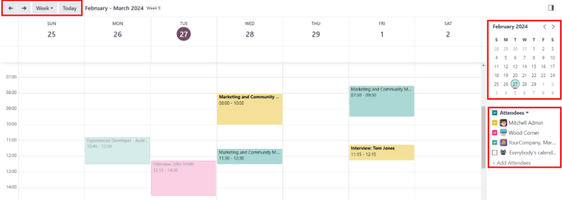
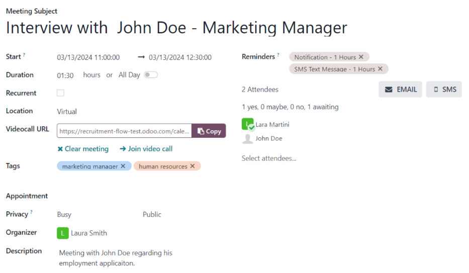
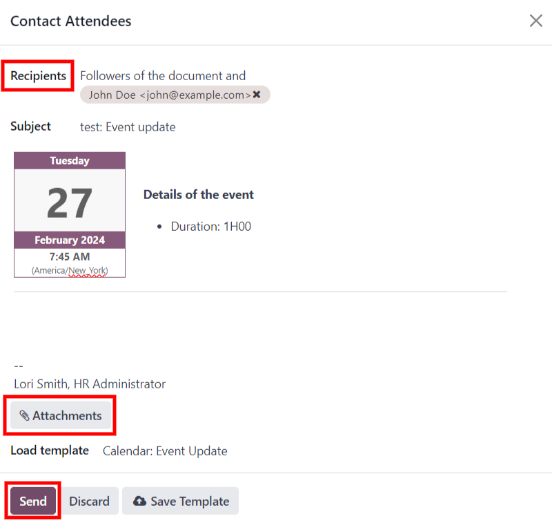
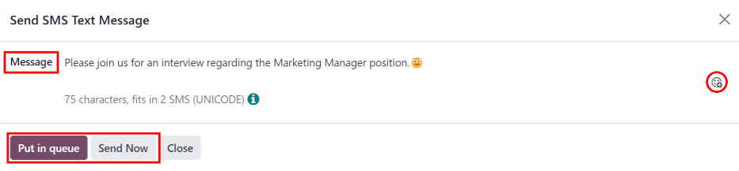
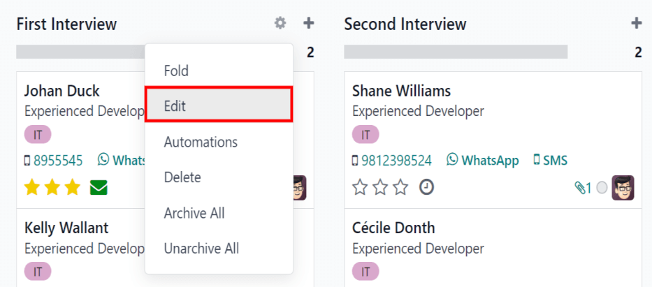
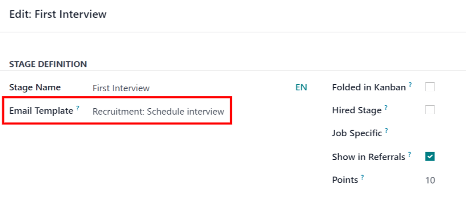
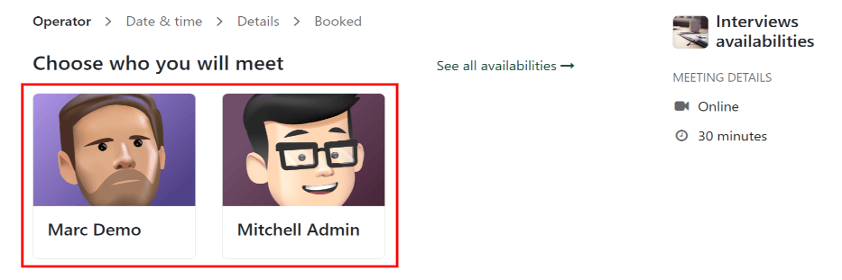
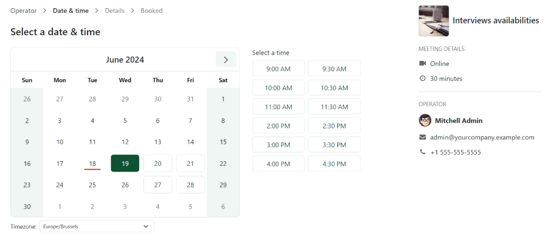
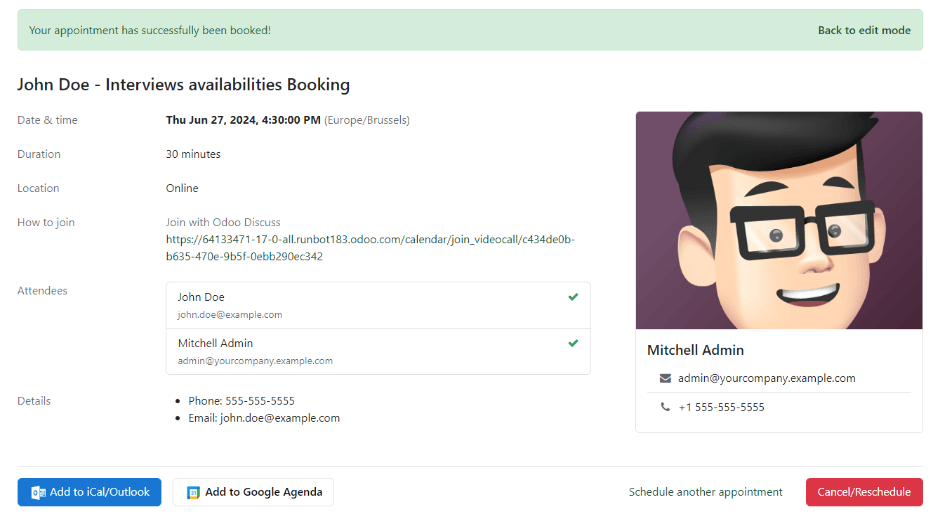

===================
Schedule interviews
===================

During the recruitment process, it is necessary to schedule interviews for applicants as they
progress through the recruitment pipeline, and reach a stage where an interview is needed.

Interviews may be conducted and scheduled to take place in-person, virtually, or over the phone. The
process for scheduling these interviews is the same, regardless of the interview format.

An interview can be scheduled in one of two ways: either by the :ref:`recruitment team
<schedule_interviews/recruitment-scheduled>` , or by the :ref:`aplicant
<schedule_interviews/applicant-scheduled>` themselves.

.. _schedule_interviews/recruitment-scheduled:

Recruitment team scheduled interviews
=====================================

When an applicant reaches an interview stage of the recruitment pipeline, it's time to schedule an
interview for that applicant. The recruitment team should first reach out to the applicant for a
date and time that works. Once a date and time have been agreed upon for both the applicant and the
interviewers, the interview can be scheduled.

First, navigate to the applicant's card by going to the :menuselection:`Recruitment app`, and click
on the relevant job card. This opens the :guilabel:`Applications` page for that job position. Then,
click on the applicant's card to view the detailed applicant form.

To schedule an interview, whether a phone, virtual, or in-person interview, click the
:guilabel:`Meeting` smart button at the top of the applicant's record.

.. note::
   The meeting smart button displays :guilabel:`No Meeting` if no meetings are currently scheduled.
   For new applicants who are new to the :guilabel:`First Interview` stage, this is the default.

   If there is one meeting already scheduled, the smart button displays :guilabel:`1 Meeting`, with
   the date of the upcoming meeting beneath it. If more than one meeting is scheduled, the button
   displays :guilabel:`Next Meeting`, with the date of the first upcoming meeting beneath it.

Doing so loads the *Calendar* application, showing the scheduled meetings and events for the
currently signed-in user, as well as the employees who are listed under the :guilabel:`Attendees`
section on the right side of the calendar view. To change the currently loaded meetings and events
being displayed, uncheck an attendee who's calendar events are to be hidden. Only the checked
attendees are visible on the calendar.

The default view is the :guilabel:`Week` view. To change the calendar view, click the
:guilabel:`Week` button, then select the desired view from the drop-down menu. The other options are
either :guilabel:`Day`, :guilabel:`Month`, or :guilabel:`Year`.

An option to display or hide weekends is available. Click the :guilabel:`Week` button, then click
:guilabel:`Show weekends` to deactivate it (the default is to show weekends). If a check mark is
next to :guilabel:`Show weekends`, weekends are visible. If there is no check mark, weekends are
hidden.

To change the displayed date range for the calendar, either use the :icon:`fa-arrow-left`
:guilabel:`(left arrow)`, :icon:`fa-arrow-right` :guilabel:`(Right arrow)`, or :guilabel:`Today`
buttons above the calendar, or click on a date in the calendar on the right side of the displayed
calendar.

To add a meeting to the calendar when in the day or week view, click on the start time of the
meeting and drag to the end time, to select the date, time, and the length of the meeting. A meeting
can also be added in this view by clicking on the day *and* the time slot the meeting is to take
place.

Both methods cause a :ref:`New Event <schedule_interviews/event-card>` pop up window to appear.

.. _schedule_interviews/event-card:

New event pop-up window
-----------------------

Enter the information on the form. The only required fields to enter are the :guilabel:`Meeting
Title`, and the :guilabel:`Start` and :guilabel:`End` fields. Once the card details are entered,
click :guilabel:`Save & Close` to save the changes and create the interview.

The fields available to populate or modify on the :guilabel:`New Event` card are as follows:

- :guilabel:`Meeting Title`: enter the subject for the meeting. This should clearly indicate the
  purpose of the meeting. The default subject is the :guilabel:`Subject/Application Name` on the
  applicant's card.
- :guilabel:`Start` and :guilabel:`End`: select the start and end date and times for the meeting.
  Click on one of the fields and a calendar pop-up window appears. Select both the start and end
  date and times, then click :guilabel:`Apply`.
- :guilabel:`All Day`: if the meeting is an all-day interview, check the box. If this box is
  checked, the :guilabel:`Start` and :guilabel:`End` fields are hidden from view.
- :guilabel:`Attendees`: select the people who should be in attendance. The default employee listed
  is the person who is creating the meeting. Add as many other people as desired.
- :guilabel:`Videocall URL`: if the meeting is virtual, or if there is a virtual option available,
  click :guilabel:`+ Odoo meeting` and a URL is automatically created for the meeting and populates
  the field.
- :guilabel:`Description`: enter a brief description in this field. There is an option to enter
  formatted text, such as numbered lists, headings, tables, as well as links, photos, and more. Use
  the powerbox feature, by typing a `/`, and a list of options are presented. Scroll through the
  options and click on the desired item. The item appears in the field and can be modified. Each
  command presents a different pop-up window. Follow the instructions for each command to complete
  the entry.

More options
~~~~~~~~~~~~

To add additional information to the meeting, click the :guilabel:`More Options` button in the
lower-right corner of the pop-up window. Enter any of the following additional fields:

- :guilabel:`Duration`: this field auto populates based on the :guilabel:`Starting At` and
  :guilabel:`Ending At` times entered. If the meeting time is adjusted, this field automatically
  adjusts to the correct duration length. The default length of a meeting is one hour.
- :guilabel:`Recurrent`: if the meeting should repeat at a selected interval (not typical for a
  first interview), check the box next to :guilabel:`Recurrent`. Several additional fields appear
  when this is enabled:

  - :guilabel:`Timezone`: using the drop-down menu, select the :guilabel:`Timezone` for the
    meetings.
  - :guilabel:`Repeat`: using the drop-down menu, select when the meetings repeat. The available
    options are :guilabel:`Daily`, :guilabel:`Weekly`, :guilabel:`Monthly`, :guilabel:`Yearly`, or
    :guilabel:`Custom`. If :guilabel:`Custom` is selected, a :guilabel:`Repeat Every` field appears
    beneath it, along with another time frequency parameter (:guilabel:`Days`, :guilabel:`Weeks`,
    :guilabel:`Months`, or :guilabel:`Years`). Enter a number in the blank field, then select the
    time period using the drop-down menu.
  - :guilabel:`Repeat on`: if :guilabel:`Weekly` is selected for the :guilabel:`Repeat` field, the
    :guilabel:`Repeat on` field appears. Click on the corresponding day to select it.
  - :guilabel:`Day of Month`: if :guilabel:`Monthly` is selected for the :guilabel:`Repeat` field,
    the :guilabel:`Day of Month` field appears. Using the drop-down menu, select either
    :guilabel:`Date of month` or :guilabel:`Day of month`. If :guilabel:`Date of month` is selected,
    enter the date the meeting repeats. If :guilabel:`Day of month` is selected, use the drop-down
    menus to determine the frequency. Select either :guilabel:`First`, :guilabel:`Second`,
    :guilabel:`Third`, :guilabel:`Fourth`, or :guilabel:`Last` for the first drop-down menu, then
    select the day (:guilabel:`Monday`, :guilabel:`Tuesday`, etc.) in the second drop-down menu.
  - :guilabel:`Until`: using the drop-down menu, select when the meetings stop repeating. The
    available options are :guilabel:`Number of repetitions`, :guilabel:`End date`, and
    :guilabel:`Forever`. If :guilabel:`Number of repetitions` is selected, enter the number of
    total meetings to occur in the blank field. If :guilabel:`End date` is selected, specify the
    date using the calendar pop-up window, or type in a date in a XX/XX/XXXX format.
    :guilabel:`Forever` schedules meetings indefinitely.

- :guilabel:`Location`: enter the location for the meeting.
- :guilabel:`Tags`: select any tag(s) for the meeting using the drop-down menu. There is no limit to
  the number of tags that can be used.
- :guilabel:`Appointment`: if an appointment is associated with this meeting, select it form the
  drop-down menu, or create a new appointment by typing in the appointment name, then click
  :guilabel:`Create & Edit...`. A :guilabel:`Create Appointment` form loads. Enter the information
  on the form, then click :guilabel:`Save & Close`.
- :guilabel:`Privacy`: select if the organizer appears either :guilabel:`Available` or
  :guilabel:`Busy` for the duration of the meeting, using the drop-down menu. Next, select the
  visibility of this meeting, using the drop-down menu to the right of the first selection. Options
  are :guilabel:`Public`, :guilabel:`Private`, and :guilabel:`Only internal users`.
  :guilabel:`Public` allows for everyone to see the meeting, :guilabel:`Private` allows only the
  attendees listed on the meeting to see the meeting, and :guilabel:`Only internal users` allows
  anyone logged into the company database to see the meeting.
- :guilabel:`Organizer`: the employee who created the meeting is populated in this field. Use the
  drop-down menu to change the selected employee.
- :guilabel:`Reminders`: select a reminder from the drop-down menu. Default options include
  :guilabel:`Notification`, :guilabel:`Email`, and :guilabel:`SMS Text Message`, each with a
  specific time period before the event (hours, days, etc). The reminder chosen alerts the meeting
  participants of the meeting via the selected option at the specified time. Multiple reminders can
  be selected in this field.

Send meeting to attendees
-------------------------

Once changes have been entered and the meeting details are correct, the meeting can be sent to the
attendees via email or text message from the expanded :guilabel:`Event Form` (what is seen when the
:guilabel:`More Options` button is clicked on in the event pop-up window).

To send the meeting via email, click the :icon:`fa-envelope` :guilabel:`Email` button next to the
list of attendees. A :guilabel:`Contact Attendees` email configurator pop-up window appears. A
pre-formatted email using the default :guilabel:`Calendar: Event Update` email template populates
the email body field. The followers of the document (job application), as well as the user who
created the meeting are added as :guilabel:`Recipients` by default. Add the applicant's email
address to the list to send the email to the applicant as well. Make any other desired changes to
the email. If an attachment is needed, click the :guilabel:`Attachments` button, navigate to the
file, then click :guilabel:`Open`. Once the email is ready to be sent, click :guilabel:`Send`.

To send the meeting via text message, click the :icon:`fa-mobile` :guilabel:`SMS` button next to
the list of attendees. A :guilabel:`Send SMS Text Message` pop-up appears.

At the top, a blue box appears if any attendees do not have valid mobile numbers, and lists how many
records are invalid. If a contact does not have a valid mobile number listed, click
:guilabel:`Close`, and edit the attendee's record, then redo these steps.

When no warning message appears, type in the message to be sent to the attendees in the
:guilabel:`Message` field. to add any emojis to the message, click the :guilabel:`Add Emoji` icon
on the right-side of the pop-up window.

Beneath the message field, the number of characters, as well as the amount of text messages required
to send the message (according to GSM7 criteria) appears. Click :guilabel:`Put In Queue` to have the
text sent later, after any other messages are scheduled, or click :guilabel:`Send Now` to send the
message immediately.

.. note::
   Sending text messages is not a default capability with Odoo. To send text messages, credits are
   required, which need to be purchased. For more information on IAP credits and plans, refer to
   the :doc:`../../essentials/in_app_purchase` documentation.

.. _schedule_interviews/applicant-scheduled:

Applicant scheduled interviews
==============================

By default, the recruitment interview stages are **not** set up so that applicant's are able to
schedule their own interviews.

If the :guilabel:`First Interview` or :guilabel:`Second Interview` stages are modified to send the
:guilabel:`Recruitment: Schedule Interview` email template when an applicant reaches that stage, the
applicant received a link to the recruitment team's calendar, and can schedule the interview on
their own. The recruitment team's availability is reflected in the calendar.

In order for applicants to be able to schedule their own interviews, a :ref:`stage must first be
modified <schedule_interviews/modify-stage>` in the *Recruitment* app.

.. _schedule_interviews/modify-stage:

Modify stage
------------

To modify either the :guilabel:`First Interview` or :guilabel:`Second Interview` stages, first
navigate to the main :menuselection:`Recruitment` app dashboard. Next, click on the desired job card
to navigate to the :guilabel:`Applications` page for that job position.

Hover over the name of the stage, and a :icon:`fa-cog` :guilabel:`(gear)` icon appears in the
upper-right hand side of the stage. Click on the :icon:`fa-cog` :guilabel:`(gear)` icon and a menu
appears. Then click on the :guilabel:`Edit` option, and an :guilabel:`Edit: (Stage)` form appears.

The :guilabel:`Email Template` field is blank, by default. Using the drop-down menu, select
:guilabel:`Recruitment: Schedule interview` for the :guilabel:`Email Template` field, then click
:guilabel:`Save & Close` when done.

Send email
----------

After either the :guilabel:`First Interview` or :guilabel:`Second Interview` stages are
:ref:`modified to send the<schedule_interviews/modify-stage>` :guilabel:`Recruitment: Schedule
interview` email to the applicant upon moving their applicant card to one of those stages, the
following email is received by the applicant:

`Subject: Can we plan an interview together for your (Job Position) application?`

`Congratulations!
Your application is really interesting and we'd like to plan an interview with you.
Can you please use the button below to schedule it with one of our recruiters?`

`Plan my interview`

Schedule interview
------------------

When the applicant received the email, they click the :guilabel:`Plan my interview` button at the
bottom of the email. This navigates the applicant to a private online scheduling page, which is
accessible only through the emailed link.

This page displays the :guilabel:`MEETING DETAILS` on the right side of the screen. This includes
the format and the length of the meeting. In this example. the interview is virtual
(:icon:`fa-video-camera` :guilabel:`Online`) and the duration is a half hour (:icon:`fa-clock-o`
:guilabel:`30 minutes`).

First, if there is an option of who to meet with, the user selects who they are scheduling their
meeting with by clicking on their icon and name. If only one person is available to interview the
applicant, this step is not available. If the applicant does not wish to chose an interviewer, they
can just click :guilabel:`See all availabilities` :icon:`fa-arrow-right`.

         interviewer.

.. note::
   If the applicant selects an interviewer, the applicant is navigated to a :guilabel:`Select a date
   & time` page, and **only** sees the dates and times that specific person is available. In
   addition, that interviewer's information (name, email, and phone number) appears on the
   right-side of the screen, under the heading :guilabel:`OPERATOR`, located beneath the
   :guilabel:`MEETING DETAILS`.

   If the applicant clicks :guilabel:`See all availabilities` :icon:`fa-arrow-right` instead, or if
   there are no interviewer options available, the user is navigated to the same :guilabel:`Select a
   date & time` page, but there is no :guilabel:`OPERATOR` section visible.

The applicant then clicks on an available day on the calendar, signified by a square around the
date. Once a day is selected, they click on one of the available times to select that date and time.

.. tip::
   Be sure to check the :guilabel:`Timezone` field, beneath the calendar, to ensure it is set to the
   correct time zone. Changing the time zone may alter the available times presented.

Once the date and time are selected, the applicant is navigated to an :guilabel:`Add more details
about you` page. This page asks the applicant to enter their :guilabel:`Full name`,
:guilabel:`Email`, and :guilabel:`Phone number`. The contact information entered on this form is how
the applicant will be contacted to remind them about the scheduled interview.

When everything is entered on the :guilabel:`Add more details about you` page, the applicant clicks
the :guilabel:`Confirm Appointment` button, and the interview is scheduled.

After confirming the interview, the applicant is navigated to a confirmation page, where all the
details of the interview are displayed. The option to add the meeting to the applicant's personal
calendars is available, through the :guilabel:`Add to iCal/Outlook` and :guilabel:`Add to Google
Agenda` buttons, beneath the interview details.

The applicant is also able to cancel or reschedule the interview, if necessary, with the
:guilabel:`Cancel/Reschedule` button.
